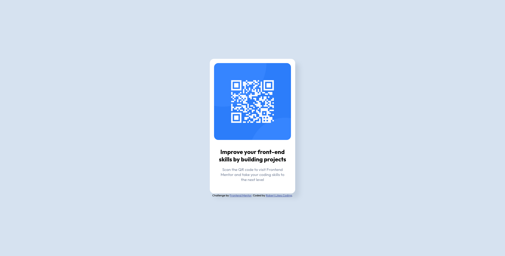

# Frontend Mentor - QR code component solution

This is my solution to the [QR code component challenge on Frontend Mentor](https://www.frontendmentor.io/challenges/qr-code-component-iux_sIO_H).

## Table of contents

  - [Screenshot](#screenshot)
  - [Links](#links)
  - [My process](#my-process)
  - [Built with](#built-with)
  - [What I learned](#what-i-learned)
  - [Author](#author)

### Screenshot

### Links

- Live Site URL: [Have a look](https://robertlikescoding.github.io/qr-code-component-main/)

## My process

 I started by creating [this text file](./where_to_start.txt) to write a guide for myself on how to approach the project.
 Then I went ahead and did all those steps one by one.

### Built with

- HTML5, CSS
- Flexbox (for centering the card)

### What I learned

I learned once more how to center a div on a blank page. Also this was a good reminder on how to integrate an image into a card. Usually I would create a "image-container" div for the image but since the challenge was basic I decided to keep it simple.

To see how you can add code snippets, see below:

## Author

- Website - [Robert.Likes.Coding](https://github.com/RobertLikesCoding)
- Frontend Mentor - [@yourusername](https://www.frontendmentor.io/profile/yourusername)

**Note: Delete this note and add/remove/edit lines above based on what links you'd like to share.**
